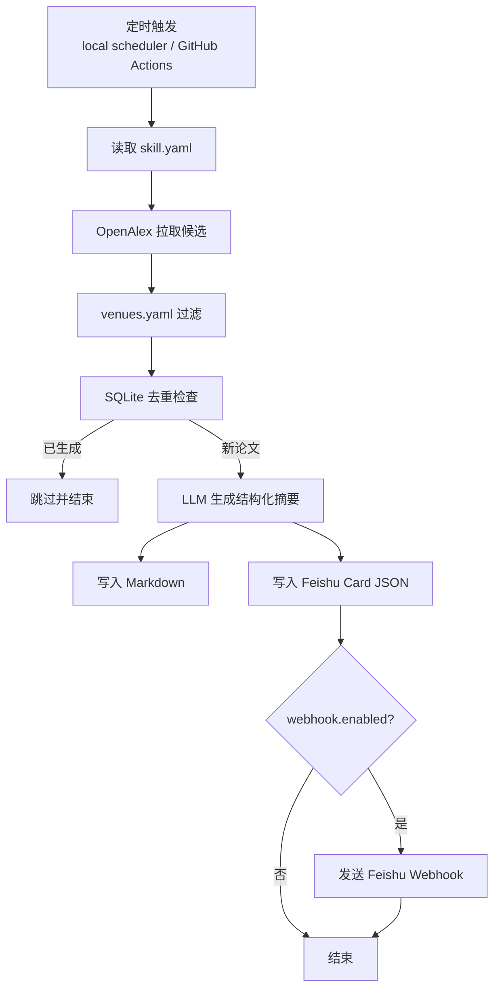

# DailyPaperReportSkill

本项目包含两部分：
- `paper-daily-mvp/`：执行引擎（检索、总结、输出、推送）
- `skill-package/paper-daily-skill/`：可安装的 Skill 封装

## 1) 快速安装 Skill

```bash
cd skill-package
./install_skill.sh
```

安装后 Skill 目录：
- `$HOME/.codex/skills/paper-daily-skill/`

## 2) 用户可自行修改的配置

### A. Skill 运行配置（必改这里）

文件：`$HOME/.codex/skills/paper-daily-skill/config/skill.yaml`

用于控制：
- 输出目录与格式（markdown / feishu card json）
- 去重开关
- webhook 开关与 URL
- 定时任务开关、时间、时区

### B. LLM 凭据（必改这里）

文件：`$HOME/.codex/skills/paper-daily-skill/config/credentials.yaml`

```yaml
llm:
  provider: compat_http
  model: deepseek-chat
  api_key: <YOUR_KEY>
  base_url: https://api.deepseek.com
  api_style: chat
```

### B2. 本地路径覆盖（可选）

文件：`$HOME/.codex/skills/paper-daily-skill/config/local.env`

作用：
- 仅用于本机路径映射（例如项目根目录）
- 不放 API Key、Webhook 等敏感信息

示例模板在仓库：
- `skill-package/paper-daily-skill/config/local.env.example`

### C. venues 筛选配置（可改）

文件：`config/venues.yaml`

你可以在这里修改：
- 顶会/期刊名单
- 不同 domain 的 venue 组
- 过滤规则

### D. Prompt 模板（可改）

文件：`prompts/zh_summary_prompt.txt`

你可以在这里修改：
- 中文总结风格
- 输出结构约束
- 卡片字段偏好

## 3) 端到端流程（定时 -> 检索 -> 去重 -> 输出 -> 推送）

1. 定时触发（本机 `launchd/cron/schtasks` 或 GitHub Actions `daily.yml`）。
2. 读取 `skill.yaml`（schedule/domain/source/query/webhook/output）。
3. 从 OpenAlex 拉取候选论文。
4. 用 `venues.yaml` 按 domain + venue 过滤。
5. 用 SQLite 记录做去重（避免重复生成同一论文）。
6. 命中新论文后调用 LLM（`credentials.yaml`）生成结构化内容。
7. 落盘 Markdown + Feishu Card JSON。
8. 若 `webhook.enabled=true` 且 URL 有效，则发送飞书卡片（失败不阻塞主流程）。



## 4) 一条命令控制（推荐）

自然语言改配置 + 重装系统定时 + 可选立即执行：

```bash
python scripts/skill_ctl.py \
  "每天19点给我一个论文" \
  --skill-config "$HOME/.codex/skills/paper-daily-skill/config/skill.yaml" \
  --run-now --verbose
```

停止定时任务：

```bash
python scripts/skill_ctl.py \
  "停止定时任务" \
  --skill-config "$HOME/.codex/skills/paper-daily-skill/config/skill.yaml"
```

## 5) 手动执行一轮

```bash
python scripts/run_from_skill_config.py --skill-config "$HOME/.codex/skills/paper-daily-skill/config/skill.yaml" --verbose
```

## 6) 本机定时任务

跨平台安装器：

```bash
python scripts/install_scheduler.py --skill-config "$HOME/.codex/skills/paper-daily-skill/config/skill.yaml"
```

- macOS: 自动安装 `launchd`
- Linux: 打印 `cron` 安装命令
- Windows: 打印 `schtasks` 命令

注意（macOS）：
- 建议将项目放在非受保护目录（例如 `~/work/paper-daily-mvp`），避免 `launchd` 访问 `Documents/Desktop/Downloads` 时出现权限错误导致定时任务不执行。

## 7) GitHub Actions（CI/CD）

- `ci.yml`：push/PR 自动跑测试（CI）
- `daily.yml`：按 cron 触发，结合 `skill.yaml` 的 `schedule.run_time` 做“到点才真正执行”

Repository **Secrets**（示例）：
- `SKILL_AUTH_TOKEN`
- `FEISHU_WEBHOOK_URL`

Repository **Variables**（示例）：
- `SKILL_MODEL`
- `SKILL_BASE_URL`

说明：`${{ }}` 只写在 workflow YAML 里，不写在 `skill.yaml` 里。

## 8) 验证

```bash
python -m unittest discover -s tests -v
```

## 9) 配置优先级（重要）

推荐使用顺序：
1. `config/skill.yaml`（功能开关、输出、定时、webhook）
2. `config/credentials.yaml`（LLM 凭据）
3. `config/local.env`（仅本机路径覆盖）

兼容说明：
- `.env` / `.env.example` 属于历史兼容入口，不是必需。
- 新安装和新用户建议仅使用上面的 `config/*.yaml + local.env`。
